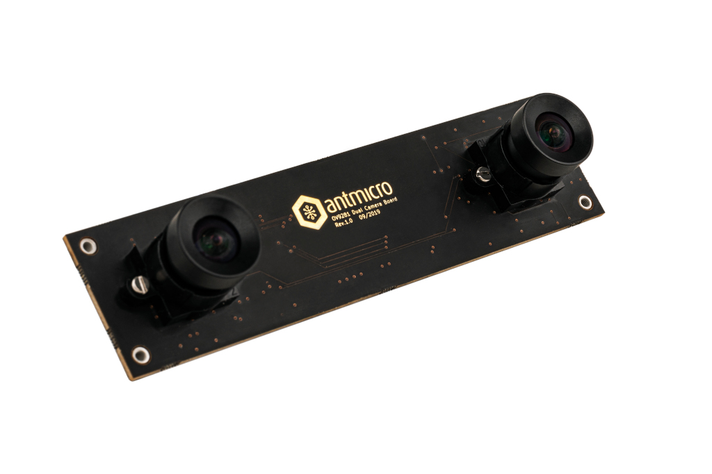

# OV9281 Dual camera board

Copyright (c) 2019-2023 [Antmicro](https://www.antmicro.com)

## Overview

This project contains open hardware design files for a dual camera module equipped with a pair of 1-megapixel [OmniVision OV9281](https://www.ovt.com/sensors/OV9281) image sensors.
The board includes mounting holes for standard S-Mount (M12) lens holders.
Each image sensor can be connected to a host platform via a separate 2-lane MIPI CSI-2 interface.
The PCB design files were prepared in KiCad 6.x.

## Key Features

* Two monochrome global shutter sensors OV9281
 
  * Pixel size: 3μm x 3 μm
  * Active array size: 1280 x 800 px
  * Optical size: 1/4 inch
  * Output formats: 8/10-bit BW RAW
  * Maximum image transfer rate: 1280 x 800 @60 fps

## Project structure 

The  main directory contains KiCad PCB project files, a LICENSE and a README. 
The remaining files are stored in the following directories: 

* `lib` - contains the component libraries 
* `img` - contains graphics for this readme 
* `assets` - contains visual assets for showcasing this design on [Open Hardware Portal](https://openhardware.antmicro.com).

The board exposes MIPI CSI-2 interfaces using unified 50-pin connector that is electrically compatible with a variety of video processing platforms created by Antmicro: 

* [Jeston Orin Baseboard](https://github.com/antmicro/jetson-orin-baseboard)
* [Jetson Nano Baseboard](https://github.com/antmicro/jetson-nano-baseboard)
* [Snapdragon 845 Baseboard](https://github.com/antmicro/snapdragon-845-baseboard)
* [Kria K26 Devboard](https://github.com/antmicro/kria-k26-devboard)

## Licensing

This project is published under the [Apache-2.0](LICENSE) license.
