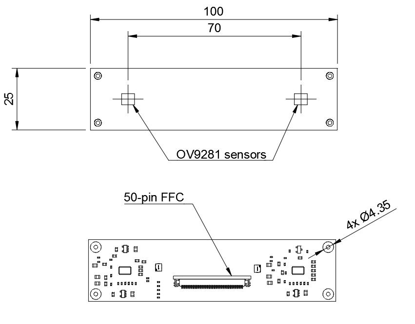

========================
OV9281 Dual camera board
========================

Copyright (c) 2019-2021 `Antmicro <https://www.antmicro.com>`_

.. Image:: img/ov9281-board-photo.jpg

Overview
========

This repository contains open hardware design files for a dual camera module created by `Antmicro <https://antmicro.com/>`_.
This board is equipped with a pair of 1-megapixel `OmniVision OV9281 <https://www.ovt.com/sensors/OV9281>`_ image sensors with mounting holes for standard S-Mount (M12) lens holders.
Each sensor can be connected to a host platform via a separate 2-lane MIPI CSI-2 interface.
The PCB design files have been written in KiCad and released as Open Source Hardware (OSHW).

Key Features
============

+------------------------------+--------------------------------------+
| Image sensor(s):             | 2 x monochrome global shutter OV9281 |
+------------------------------+--------------------------------------+
| Pixel size:                  | 3μm x 3 μm                           |
+------------------------------+--------------------------------------+
| Active array size:           | 1280 x 800                           |
+------------------------------+--------------------------------------+
| Optical size:                | 1/4 inch                             |
+------------------------------+--------------------------------------+
| Lens mount:                  | M-12 (S-Mount)                       |
+------------------------------+--------------------------------------+
| Output interface:            | 50-pin FFC connector                 |
+------------------------------+--------------------------------------+
| Output formats:              | 8/10-bit BW RAW                      |
+------------------------------+--------------------------------------+
| Maximum image transfer rate: | 1280 x 800 @60 fps                   |
+------------------------------+--------------------------------------+

Interface connector
===================

The board uses a 50-pin FFC connector which exposes two separate MIPI CSI interfaces for both cameras, along with power supply rails and separate I2C buses used for sensor configuration.
The board is electrically compatible with Antmicro's products and open hardware designs, including `Jetson Nano baseboard <https://github.com/antmicro/jetson-nano-baseboard>`_,
`Google Coral Baseboard <https://github.com/antmicro/google-coral-baseboard>`_ or `Zynq Video Board <https://github.com/antmicro/zynq-video-board>`_.

For more details regarding the on-board circuitry please refer to the respective schematic sheets.

Mechanics
=========

Board dimensions:

License
=======

`Apache-2.0 <LICENSE>`_